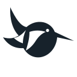
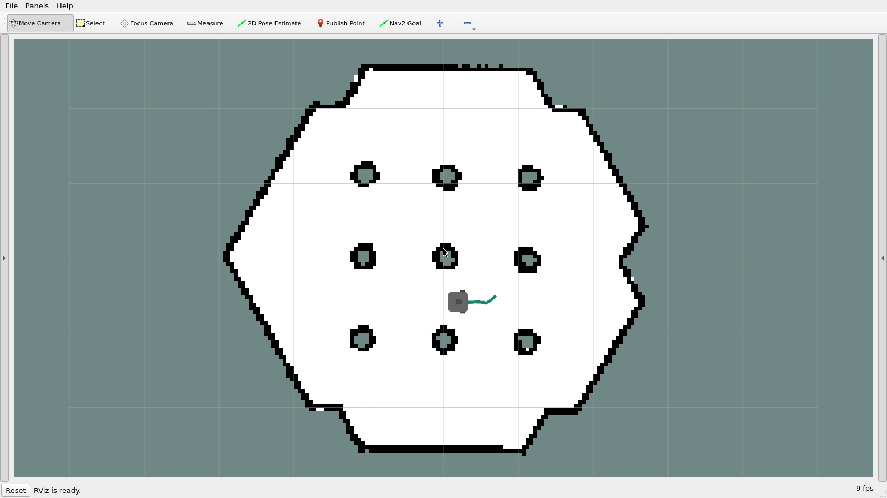

<p align="center">
  <picture>
    <source media="(prefers-color-scheme: dark)" srcset="docs/assets/brand/kingfisher-dark.svg">
    
  </picture>
</p>
<h1 align="center">Robot Harness</h1>
<p align="center"><strong>A harness for embodied intelligence.</strong><br>From intent to action. Back with evidence.</p>
<p align="center">
  <a href="https://xiao-yang25.github.io/robot-harness/">Website</a> ·
  <a href="#build">Quick start</a> ·
  <a href="docs/README.md">Documentation</a> ·
  <a href="examples/README.md">Examples</a> ·
  <a href="CONTRIBUTING.md">Contribute</a>
</p>
<p align="center">
  <a href="https://github.com/xiao-yang25/robot-harness/actions/workflows/core.yml"></a>
  <a href="https://github.com/xiao-yang25/robot-harness/actions/workflows/ros2.yml"></a>
</p>

Robot Harness is building the execution foundation between **agents, robot skills
and the physical world**. The aim is to make actions observable, interruptible and
composable—and make their outcomes useful for the next decision and future improvement.

Its experimental C++17 Core starts with three questions: **May this action run?
May this result be used? Is the previous work settled enough to proceed?**
Applications choose goals; robot stacks retain control and device protection.

## See it move

[](https://xiao-yang25.github.io/robot-harness/#demo)

[Watch the 24-second recording](https://xiao-yang25.github.io/robot-harness/#demo) ·
[Download MP4](docs/assets/demo/navigation.mp4) · [Demo details](docs/assets/demo/README.md)

An actual TurtleBot3 / Nav2 simulation, viewed in RViz. This early recording shows
normal navigation through Harness; later handoff work is described in the docs.

## Build

Requires a C++17 compiler and CMake 3.16+. No model or robot is needed for this first run.

```sh
git clone https://github.com/xiao-yang25/robot-harness.git
cd robot-harness
cmake -S . -B build -DBUILD_TESTING=ON -DCMAKE_BUILD_TYPE=Debug
cmake --build build --parallel 2
(cd build && ctest --output-on-failure)
./build/robot_harness_normal_execution
```

Expect sums **29** and **61**, with accepted results and settled work.
Continue with [two-step tasks](examples/README.md#local-compute-and-two-step-tasks),
[cancellation](examples/README.md#failure-cancellation-and-deadlines), or the
[Ubuntu container](docs/TESTING.md#ubuntu-development-container).
[Build troubleshooting](examples/README.md#if-a-command-fails).
For robot motion, follow the [Humble/Gazebo simulation tutorial](integrations/ros2/simulation/README.md).

## Current scope

| Available today | Next |
|---|---|
| Execution authority, guarded results, cancellation and deadlines | Interactive simulation and backend tutorials |
| Local workers, dependent tasks, replacement and provider rebinding | Broader loss and recovery coverage |
| Limited Linux Host recovery; experimental Nav2 sequencing, moving cancellation, replacement and bounded loss isolation | Broader robot skills and learning-based backends |

**Early-stage software and simulation.** No physical-robot integration or hard stop
guarantee yet. Recovery requires a surviving, polled Owner; sequential navigation
uses an exclusive simulator. The source-built [simulation package](integrations/ros2/simulation/README.md)
provides the matching native fixture. See [tested behavior and limits](docs/TESTING.md#current-validation-baseline)
and the [architecture](docs/DESIGN.md#product-boundary). Learning and self-improvement
are future directions, not current product capabilities.

## Interfaces and compatibility

C++17 · ROS-independent Core · source-tree examples. APIs are evolving; there is
no stable SDK/API/ABI or published release yet. Start with the
[architecture guide](docs/README.md#understand-the-architecture) or
[backend integration](docs/README.md#connect-a-backend).

## Contributing

[Report a bug](https://github.com/xiao-yang25/robot-harness/issues/new?template=bug_report.md),
[discuss an integration](https://github.com/xiao-yang25/robot-harness/issues/new?template=proposal.md),
or read [CONTRIBUTING](CONTRIBUTING.md). The [kingfisher](docs/assets/brand/README.md)
is our preview identity and may evolve.

## License

License and patch contribution terms are pending. See the
[licensing status](CONTRIBUTING.md#licensing-status) before submitting patches or adopting the code.
