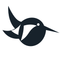
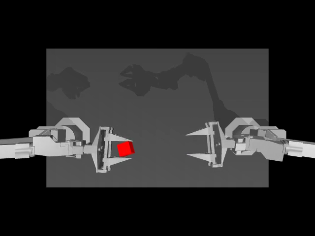
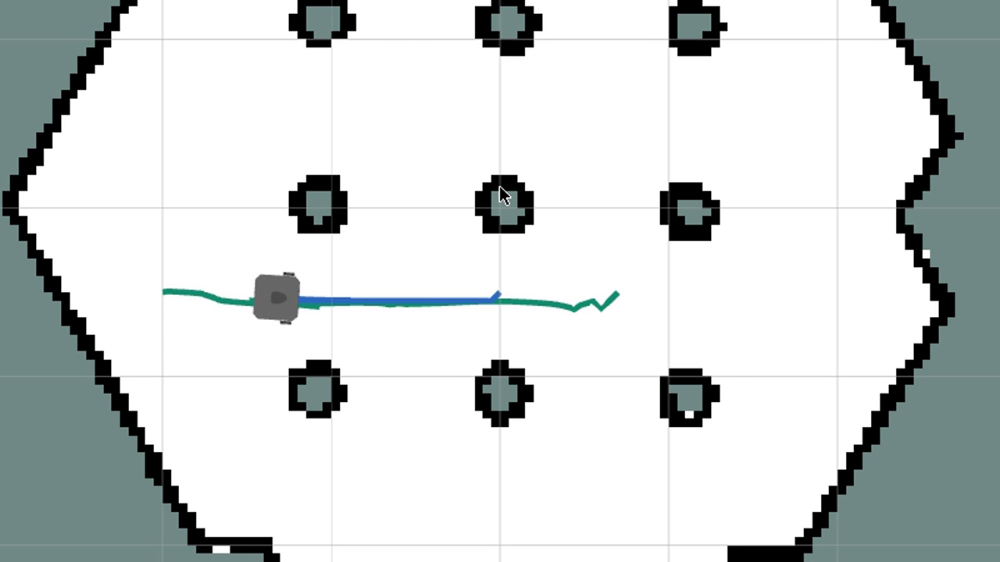

<p align="center">
  <picture>
    <source media="(prefers-color-scheme: dark)" srcset="docs/assets/brand/kingfisher-dark.svg">
    
  </picture>
</p>
<h1 align="center">Robot Harness</h1>
<p align="center"><strong>A harness for embodied intelligence.</strong><br>From intent to action. Back with evidence.</p>
<p align="center">
  <a href="https://xiao-yang25.github.io/robot-harness/">Website</a> ·
  <a href="#build">Quick start</a> ·
  <a href="docs/README.md">Documentation</a> ·
  <a href="examples/README.md">Examples</a> ·
  <a href="CONTRIBUTING.md">Contribute</a>
</p>
<p align="center">
  <a href="https://github.com/xiao-yang25/robot-harness/actions/workflows/core.yml"></a>
  <a href="https://github.com/xiao-yang25/robot-harness/actions/workflows/ros2.yml"></a>
</p>

Robot Harness is building the execution foundation between **agents, robot skills
and the physical world**. The aim is to make actions observable, interruptible and
composable—and make their outcomes useful for the next decision and future improvement.

Its experimental C++17 Core starts with three questions: **May this action run?
May this result be used? Is the previous work settled enough to proceed?**
Applications choose goals; robot stacks retain control and device protection.

## See it move

<p align="center">
  <a href="https://xiao-yang25.github.io/robot-harness/#demo"></a>
  <a href="https://xiao-yang25.github.io/robot-harness/#navigation-demo"></a>
</p>

**[Manipulation: transfer → hold](https://xiao-yang25.github.io/robot-harness/#demo).**
ACT supplies 400 transfer steps; Runtime admits a separate 50-step hold in the
same scene. The complete nine-second clip follows simulation time, omitting
inference waits. A deterministic caller selects the skills.

**[Navigation: cancel → hand off](https://xiao-yang25.github.io/robot-harness/#navigation-demo).**
TurtleBot3 moves, A is cancelled, and B starts after A settles. A companion clip
shows stopping with settlement still pending.

Click a cover to watch. Actual scripted simulations; original recordings and
same-run evidence are in the [recording notes](docs/assets/demo/README.md).

## Build

Requires a C++17 compiler and CMake 3.16+. No model or robot is needed for this first run.

```sh
git clone https://github.com/xiao-yang25/robot-harness.git
cd robot-harness
cmake -S . -B build -DBUILD_TESTING=ON -DCMAKE_BUILD_TYPE=Debug
cmake --build build --parallel 2
(cd build && ctest --output-on-failure)
./build/robot_harness_normal_execution
```

Expect sums **29** and **61**, with accepted results and settled work.
Continue with [two-step tasks](examples/README.md#local-compute-and-two-step-tasks),
[cancellation](examples/README.md#failure-cancellation-and-deadlines), or the
[Ubuntu container](docs/TESTING.md#ubuntu-development-container).
[Build troubleshooting](examples/README.md#if-a-command-fails).
For robot motion, follow the [Humble/Gazebo simulation tutorial](integrations/ros2/simulation/README.md),
or use the [local live viewer](integrations/ros2/simulation/README.md#watch-a-live-run)
to watch navigation, cancellation and replacement.

## Current scope

| Available today | Next |
|---|---|
| Execution authority, guarded results, cancellation and deadlines | Contributor reproduction and further backend tutorials |
| Local workers, dependent tasks, replacement and provider rebinding | Broader loss and recovery coverage |
| Limited Linux Host recovery; experimental Nav2 sequencing, moving cancellation, replacement and bounded loss isolation | Broader robot skills and learning-based backends |

[M4 simulation scope is complete](docs/TESTING.md#m4-closeout). The
[Runtime slice](docs/RUNTIME_SLICE.md) provides a session host, policy worker and
Python/Core bridge, with an [external Agent consumer](docs/DESIGN.md#agent-consumer-and-repository-organization)
developed alongside it. The optional [Python session](bindings/python/README.md)
now runs a deterministic fixture and optional [MuJoCo/ACT profiles](integrations/mujoco/README.md)
through the real Core: repeated trials, or an opt-in400-step transfer followed by
a separately admitted50-step hold in one episode.
The optional [local MCP integration](integrations/mcp/README.md) lets existing agents
such as Codex consume this session. Its tool path is separate from an embodied
business Agent's task state, perception interpretation and recovery; that application
may use Runtime directly. The first
[Robot Agent application](https://github.com/xiao-yang25/robot-agent/tree/c3b291c5d39c5ce32df472acfc071a457f509b77)
uses camera/joints to choose transfer and a subsequent hold. Its
[pinned skill setup](https://github.com/xiao-yang25/robot-agent/blob/c3b291c5d39c5ce32df472acfc071a457f509b77/skills/aloha/README.md)
provides the worker, dependencies and weight preparation.

[M5's selected scope is delivered](docs/TESTING.md#m5-closeout): one ALOHA
business task, public two-repository preparation, Mac/MPS and selected Linux
ARM/CPU normal paths, bounded counterexamples and a comparable native task owner.
Agent `c3b291c` pins Harness `0de9eb0`; this combination passed installed deterministic
consumption. Earlier real visual results retain their original Harness `3acc9aa`
scope. The comparison supports responsibility reuse, with no established general
speed, memory or net development-time advantage. Before M6, complete mainline
delivery of the public evaluator/regressions and
[installed combination CI](docs/TESTING.md#installed-agent-combination). M6 then
selects one heterogeneous combination and tests what actually carries over.
Extend [embodiment and backend coverage](docs/DESIGN.md#incremental-embodiment-and-backend-coverage)
one reproducible task at a time. Simulation work can proceed independently of
physical-device availability; hardware validation retains its own prerequisites.
[Preview and adoption preparation](CONTRIBUTING.md#adoption-stages) proceeds alongside
integration work; a versioned preview and external reproduction remain pending.

**Early-stage software and simulation.** No physical-robot integration or hard stop
guarantee yet. Recovery requires a surviving, polled Owner; sequential navigation
uses an exclusive simulator. The source-built [simulation package](integrations/ros2/simulation/README.md)
provides the matching native fixture. See [tested behavior and limits](docs/TESTING.md#current-validation-baseline)
and the [architecture](docs/DESIGN.md#product-boundary). Learning and self-improvement
are future directions, not current product capabilities.

## Interfaces and compatibility

C++17 · ROS-independent Core · [CMake installation](examples/installed_core/README.md)
and source-tree adapters/examples. APIs are evolving; there is
no stable SDK/API/ABI or published release yet. Start with the
[architecture guide](docs/README.md#understand-the-architecture) or
[backend integration](docs/README.md#connect-a-backend).

## Contributing

[Report a bug](https://github.com/xiao-yang25/robot-harness/issues/new?template=bug_report.md),
[discuss an integration](https://github.com/xiao-yang25/robot-harness/issues/new?template=proposal.md),
or read [CONTRIBUTING](CONTRIBUTING.md). The [kingfisher](docs/assets/brand/README.md)
is our preview identity and may evolve.

## License

Except for third-party material with its own notices, Robot Harness is licensed
under [MIT](LICENSE-MIT) OR [Apache-2.0](LICENSE-APACHE), at your option.
See the [license declaration](LICENSE),
[contribution terms](CONTRIBUTING.md#licensing-status) and
[simulation third-party notices](integrations/ros2/simulation/THIRD_PARTY_NOTICES.md).
